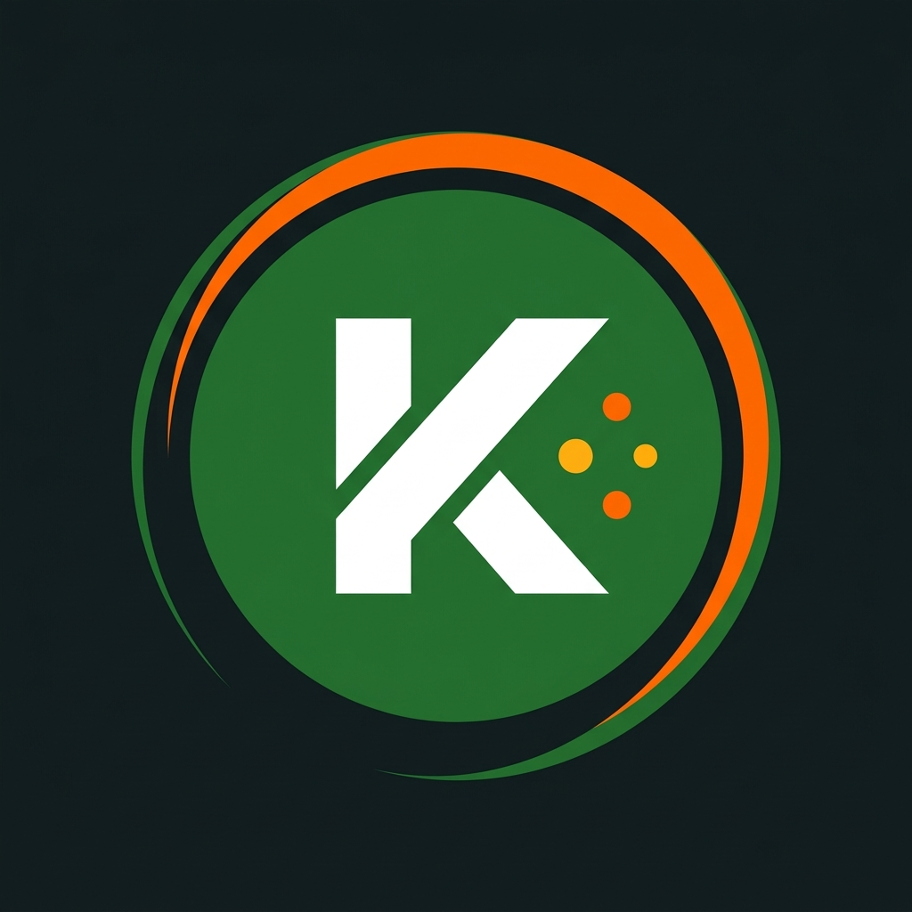
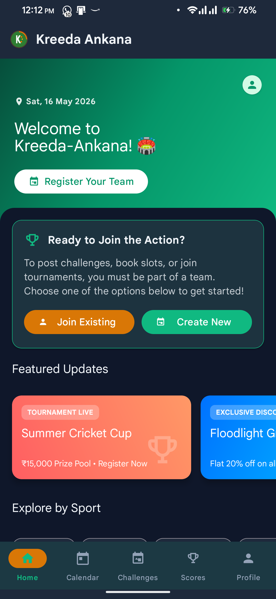
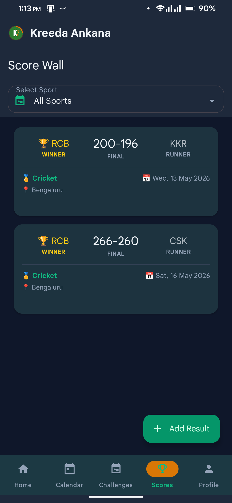
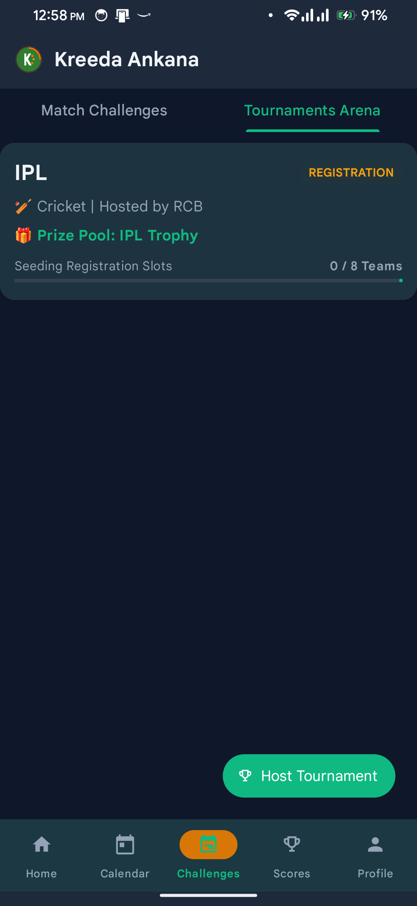
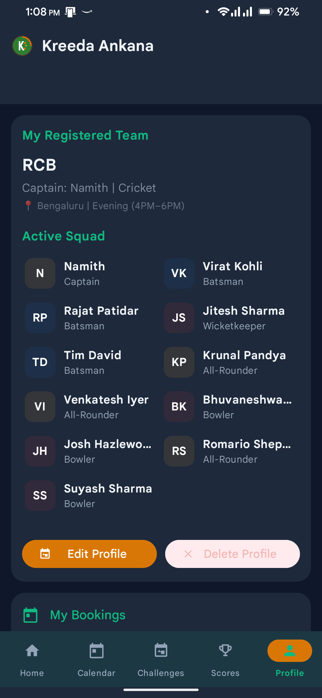
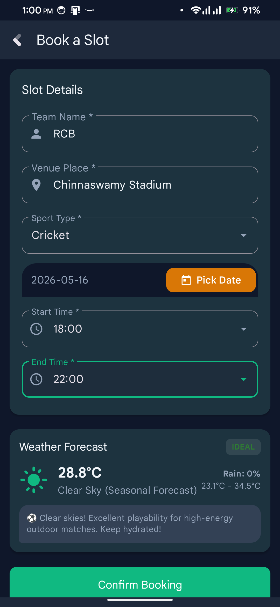
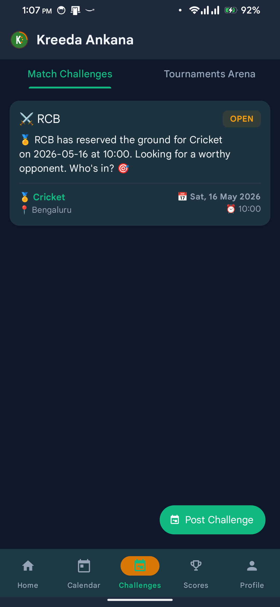
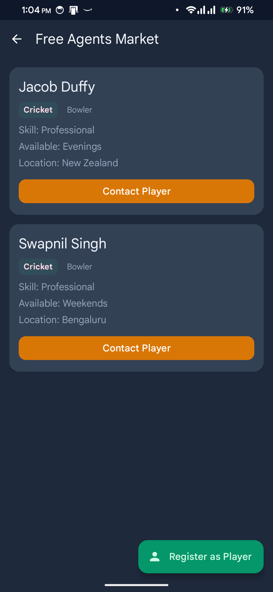
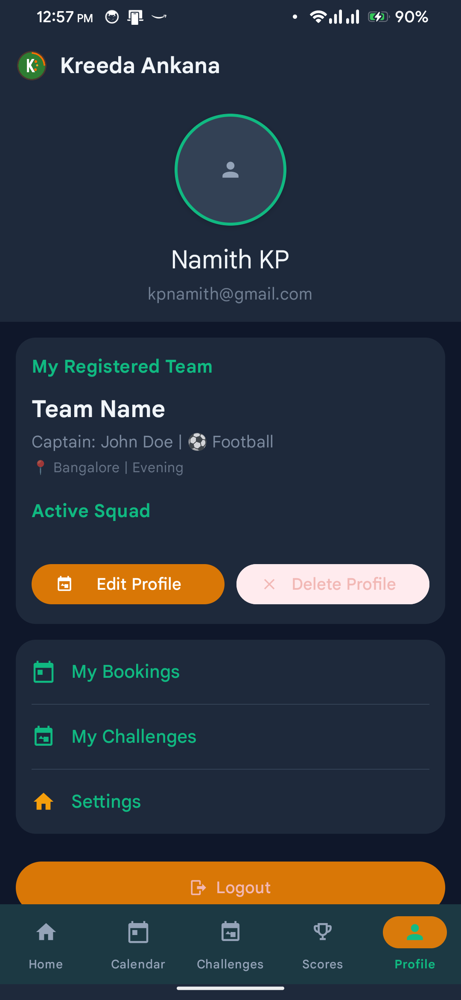
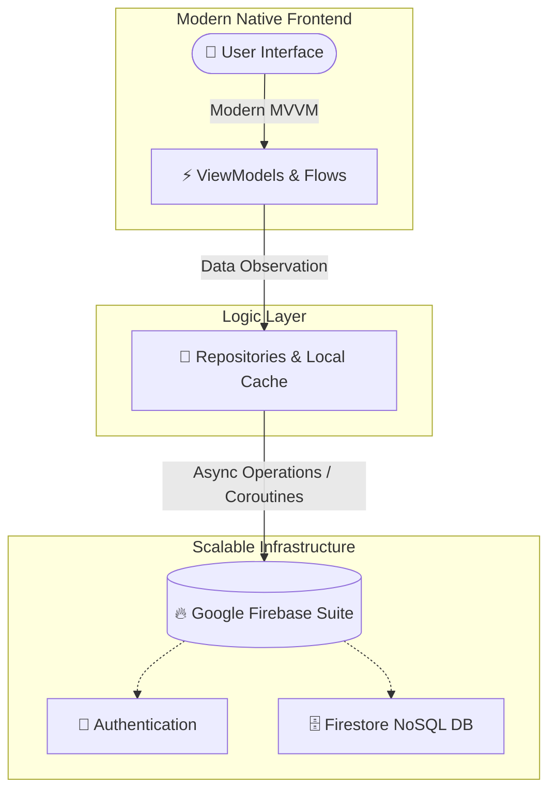

# ⚡ KREEDA ANKANA (ಕ್ರೀಡಾ ಅಂಕಣ) ⚡

<p align="center">
  
</p>

<p align="center">
  <a href="https://kotlinlang.org"></a>
  <a href="https://developer.android.com"></a>
  <a href="https://firebase.google.com"></a>
  <a href="https://gradle.org"></a>
</p>

---

> **`Kreeda Ankana`** *(Sanskrit/Kannada: Sports Arena)* is a premium, state-of-the-art native Android application designed to unify the local sports ecosystem. It functions as a cinematic center-stage dashboard for **automated stadium booking, dynamic tournament brackets, real-time match scores, squad creation, and player matchmaking.**

---

## 📸 APP SHOWCASE

<div align="center">
  <table>
    <tr>
      <td align="center"><b>🏟️ Home Dashboard</b></td>
      <td align="center"><b>📈 Live Score Wall</b></td>
      <td align="center"><b>🏆 Tournament Brackets</b></td>
      <td align="center"><b>🛡️ Squad Builder</b></td>
    </tr>
    <tr>
      <!-- Drop your screenshots in the 'screenshots' folder and name them as below, or update the links! -->
      <td></td>
      <td></td>
      <td></td>
      <td></td>
    </tr>
    <tr>
      <td align="center"><b>📅 Turf Booking</b></td>
      <td align="center"><b>🎯 Challenges</b></td>
      <td align="center"><b>🤝 FA Matcher</b></td>
      <td align="center"><b>👤 Player Profile</b></td>
    </tr>
    <tr>
      <td></td>
      <td></td>
      <td></td>
      <td></td>
    </tr>
  </table>
</div>

---

## 🛠️ ARCHITECTURAL STACK & ENGINE SPECS



### 🧬 SYSTEM PROTOCOLS
* **Architecture Style:** Clean MVVM (Model-View-ViewModel) + Single Source of Truth Repository Pattern.
* **UI Engine:** Material 3 Components, customized Vector Assets, and premium micro-interactions.
* **Data Syncer:** Firebase Firestore with live continuous listeners and composite multi-field indexing.
* **Intro Sequencer:** Custom center-cropped video playback wrapper matching physical view aspect ratios with zero stretching.

---

## 🚀 HIGH-PRIORITY FEATURES

| Module | Feature Set | Technical Magic | Status |
| :--- | :--- | :--- | :---: |
| 🎬 **Splash Reveal** | Center-Crop Intro Video | Aspect-ratio calculations with FrameLayout gravity centering | `STABLE` |
| 🛡️ **Squad Guard** | Sport-Specific Uniqueness | Firestore compound query checking for exclusive team names | `STABLE` |
| 📅 **Slot Engine** | Sports Ground Booking | Multi-category dynamic calendar selector with status badges | `STABLE` |
| 🏆 **Cup Brackets** | Tournament Management | Live dynamic bracket logic for tourneys & register pipelines | `STABLE` |
| 📈 **Score Stream** | Real-time Scoring Wall | Multi-sport score updates with asynchronous Firestore feeds | `STABLE` |
| 🤝 **FA Matcher** | Free Agents Matchmaking | Roster positioning checker for players looking to join squads | `STABLE` |
| 💬 **Peer Lobby** | Squad challenges & Chat | Direct challenge matching boards with integrated chat modules | `STABLE` |

---

## 🧬 CODE SNIPPET SHIELD: SPORT-SPECIFIC SQUAD CHECKER

A look inside the unique sport-specific validator logic. Teams can share names across *different* sports, but names are locked and protected within the *same* sport!

```kotlin
suspend fun isTeamNameTaken(teamName: String, sport: String, excludeTeamId: String? = null): Boolean {
    return try {
        val query = teamsCollection
            .whereEqualTo("teamName", teamName.trim())
            .whereEqualTo("sport", sport)
            .get()
            .await()
            
        val documents = query.documents
        if (excludeTeamId != null) {
            documents.any { it.id != excludeTeamId }
        } else {
            documents.isNotEmpty()
        }
    } catch (e: Exception) {
        false
    }
}
```

---

## 📁 PROJECT STRUCTURE

The Kreeda Ankana app follows a clean architecture pattern with a strong separation of concerns, heavily utilizing Kotlin Coroutines, ViewModels, and Android ViewBinding.

```text
Kreeda-Ankana/
├── app/
│   ├── build.gradle.kts                # App-level build logic & dependencies
│   ├── google-services.json            # Firebase credentials (local only)
│   └── src/
│       └── main/
│           ├── AndroidManifest.xml     # Application configuration & permissions
│           ├── java/com/kreedaankana/
│           │   ├── ui/                 # View layer: Activities, Fragments, Adapters
│           │   │   ├── auth/           # Login, OTP verification
│           │   │   ├── home/           # Dashboard & Main feed
│           │   │   └── profile/        # Squad builder & Profile management
│           │   ├── data/               # Model layer: Entities & Data classes
│           │   │   └── model/          # User, Team, Match objects
│           │   ├── repository/         # Data access & Firebase integration layer
│           │   └── viewmodel/          # State management & Business logic
│           └── res/                    # Resources layer
│               ├── layout/             # XML layouts (Material 3 components)
│               ├── drawable/           # Vector icons & background aesthetics
│               ├── values/             # Colors, themes, typography, and strings
│               └── raw/                # Intro videos & cinematic assets
├── build.gradle.kts                    # Root project build configuration
└── .github/
    └── workflows/                      # CI/CD pipelines & GitHub Actions automations
```

---

## 🚀 SETUP & INTEGRATION DEPLOYMENT

> [!IMPORTANT]
> The remote GitHub repository has been configured to **strictly protect your secure credentials**. Live credentials (`google-services.json`, signing keystores, and local environment properties) are completely gitignored.

### 📋 Prerequisites
* Android Studio (Koala / Ladybug or newer)
* Android SDK 34+
* JDK 17 (recommended target)

### 🛠️ Local Assembly Protocol

#### 1. Clone the project locally
```bash
git clone https://github.com/Namith-kp/Kreeda-Ankana.git
cd "Kreeda Ankana"
```

#### 2. Supply Local Firebase Credentials
The project has a configuration example file at [app/google-services.json.example](file:///C:/Users/HP/Documents/Projects/Kreeda%20Ankana/app/google-services.json.example).
1. Copy the example file to a new file named `google-services.json` inside the `app/` folder:
   ```bash
   cp app/google-services.json.example app/google-services.json
   ```
2. Replace the placeholder strings with your live Firebase configurations (API keys, project IDs, etc.).

#### 3. Create Local SDK Properties File
Create a `local.properties` file in the root directory specifying your Android SDK path:
```properties
sdk.dir=C\:\\Users\\YOUR_SYSTEM_USER\\AppData\\Local\\Android\\Sdk
```

#### 4. Compile the App
Build your release APK instantly using Gradle:
```bash
./gradlew assembleDebug
```
The output APK will be placed in `app/build/outputs/apk/debug/app-debug.apk`.

---

## 🎛️ GRADLE ENGINE CONTROL PANEL

* **Compile Codebase:** `./gradlew compileDebugKotlin`
* **Run Linter:** `./gradlew lint`
* **Clean Build Cache:** `./gradlew clean`
* **Direct APK Build:** `./gradlew assembleDebug`

---

## 💎 DESIGN ATTRIBUTION & CONTRIBUTORS

* **Aesthetic Visualizer:** Antigravity AI Designer
* **Core Language:** Kotlin & Material UI
* **Lead System Architect:** You (Pair Programming)

<p align="center" style="margin-top: 30px;">
  <b>✨ Developed with passion for the sports universe. ✨</b>
</p>
